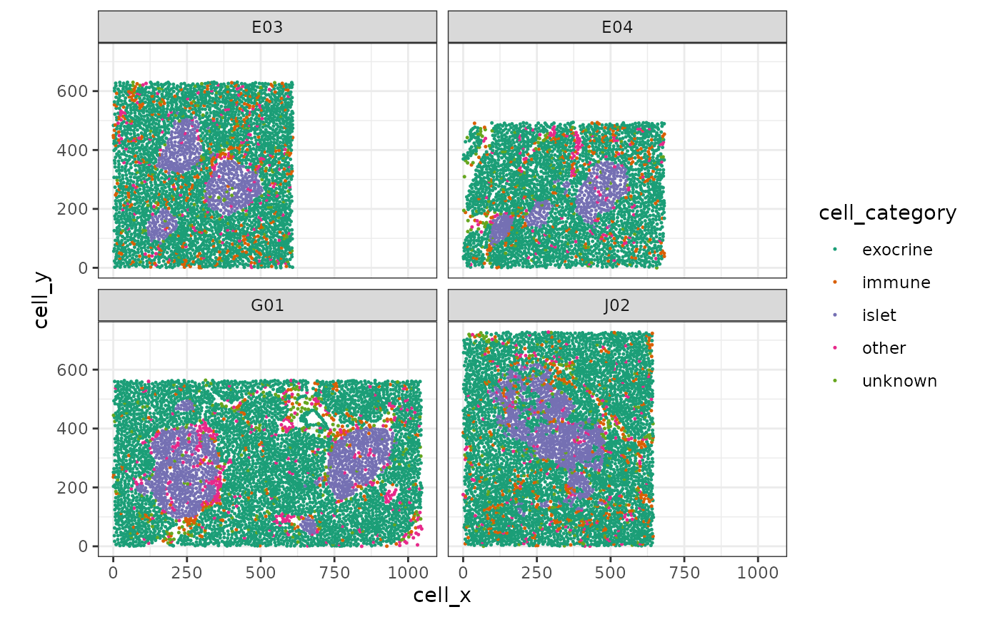
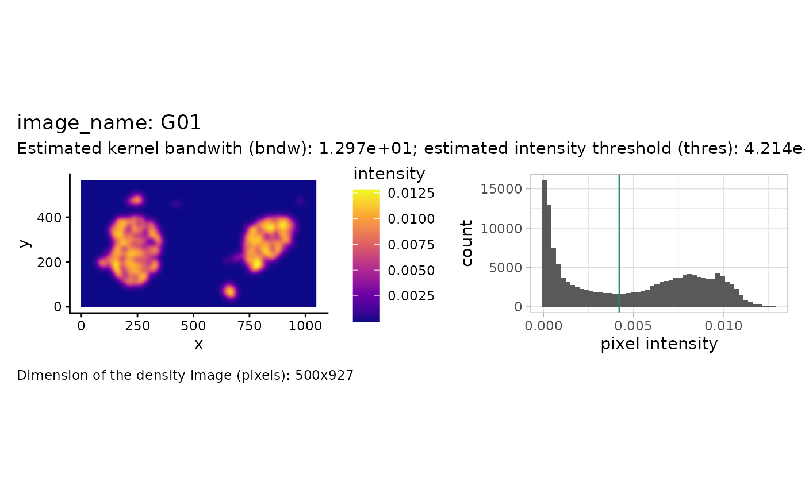
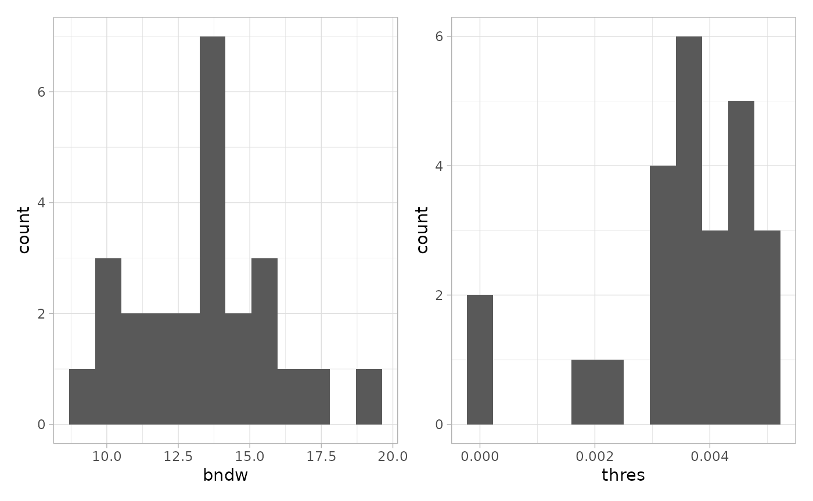
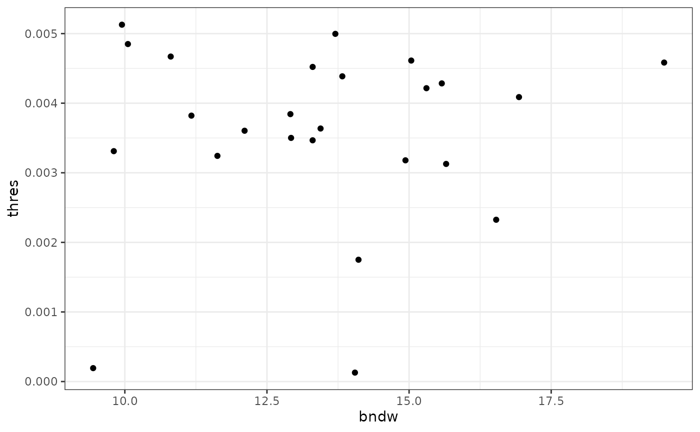
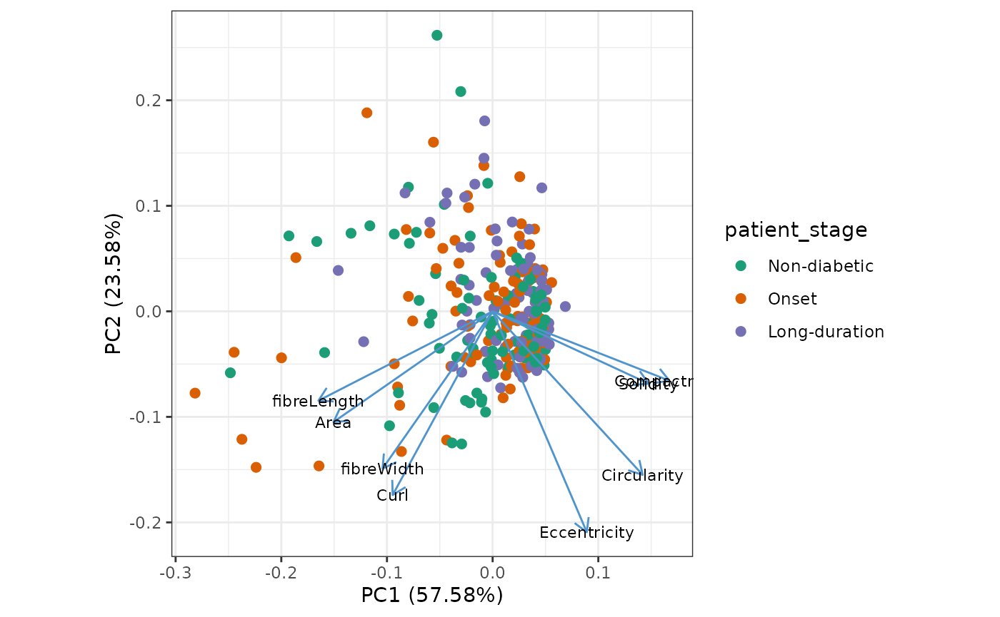
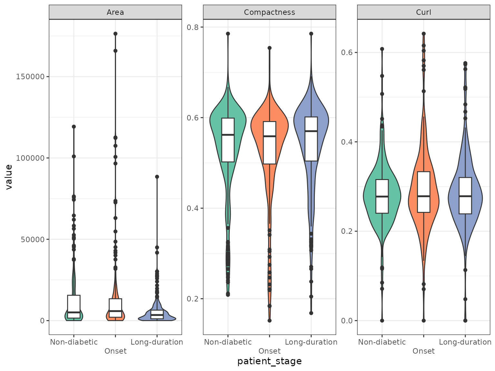
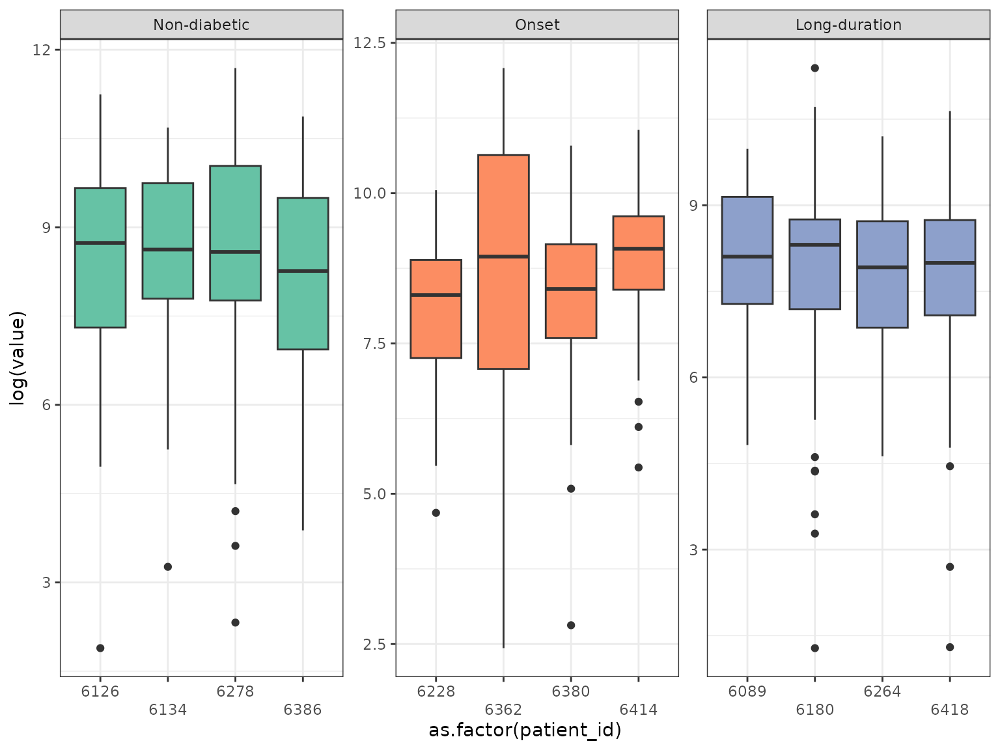
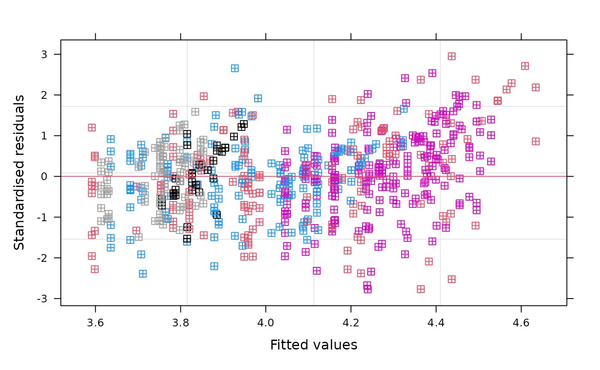

# 02 -- Reconstruction and analysis of pancreatic islets from IMC data

Abstract

In this vignette we use `sosta` to reconstruct pancreatic islets of
different diabetic stages from IMC data (Damond et al. 2019). Based on
the reconstruction we calculate structure metrics. Finally, we show how
to do staticstical comparison of the metrics accounting for the
correlation structure of the dataset.

## Installation

The *[sosta](https://bioconductor.org/packages/3.22/sosta)* package can
be installed from Bioconductor as follows:

``` r
if (!requireNamespace("BiocManager")) {
    install.packages("BiocManager")
}
BiocManager::install("sosta")
```

## Setup

For this vignette, we will need several additional packages:

``` r
library("dplyr")
library("ExperimentHub")
library("ggplot2")
library("lme4")
library("lmerTest")
library("sf")
library("SpatialExperiment")
library("sosta")
library("tidyr")
library("ggfortify")

theme_set(theme_bw())
```

## Introduction

In this vignette, we will use an imaging mass cytometry (IMC) dataset of
pancreatic islets from human donors at different stages of type 1
diabetes (T1D) and healthy controls (Damond et al. 2019).

First, we plot the data for illustration. As we have multiple images per
patient, we will subset to a few slides. As can be seen, the dimensions
of the field of view are differing.

``` r
df <- cbind(
    colData(spe[, spe$image_name %in% c("E04", "E03", "G01", "J02")]),
    spatialCoords(spe[, spe$image_name %in% c("E04", "E03", "G01", "J02")])
)
df |>
    as.data.frame() |>
    ggplot(aes(x = cell_x, y = cell_y, color = cell_category)) +
    geom_point(size = 0.25) +
    facet_wrap(~image_name, ncol = 2) +
    coord_equal() +
    scale_color_brewer(palette = "Dark2")
```



Our goal is to reconstruct / segment and quantify the pancreatic islets.

## Reconstruction of pancreatic islets

### Reconstruction of pancreatic islets for one image

In this example, we will reconstruct the islets based on the point
pattern *density* of the islet cells. We will start with estimating the
parameters that we use for reconstruction afterwards. For one image this
can be illustrated as follows.

``` r
shapeIntensityImage(
    spe,
    marks = "cell_category",
    imageCol = "image_name",
    imageId = "G01",
    markSelect = "islet"
)
```



We see the density (pixel-level) image on the left and a histogram of
the intensity values on the right. The estimated threshold is roughly
the mean between the two modes of the (truncated) pixel intensity
distribution.

Note that the above calculation was done for one image. The function
`estimateReconstructionParametersSPE` returns two plots with the
estimated parameters for each image. The parameter `bndw` is the
bandwidth parameter that is used for estimating the intensity profile of
the point pattern. The parameter `thres` is the estimated parameter for
the density threshold for reconstruction. We subset 25 random images to
speed up computation.

``` r
n <- estimateReconstructionParametersSPE(
    spe,
    marks = "cell_category",
    imageCol = "image_name",
    markSelect = "islet",
    nImages = 25,
    plotHist = TRUE
)
```



We can inspect the relationship of the estimated bandwidth and
threshold.

``` r
n |>
    ggplot(aes(x = bndw, y = thres)) +
    geom_point()
```



We note that the estimated bandwidth seems to vary a bit more than the
estimated threshold. We will use the mean of the two estimated vectors
as our parameters.

``` r
(thresSPE <- mean(n$thres))
#> [1] 0.003578595
(bndwSPE <- mean(n$bndw))
#> [1] 13.4399
```

### Reconstruction of pancreatic islets for all images

The function `reconstructShapeDensitySPE` reconstructs the islets for
all images in the `spe` object. We use the estimated parameters from
above. For computational reasons, we will subset to 20 images per
patient for the rest of the vignette.

``` r
# Sample 15 images per patient
sel <- colData(spe) |>
    as.data.frame() |>
    group_by(patient_id) |>
    select(image_name) |>
    sample_n(size = 20, replace = FALSE) |>
    pull(image_name)
#> Adding missing grouping variables: `patient_id`

# Select sampled images
speSel <- spe[, spe$image_name %in% sel]
speSel$image_name |>
    unique() |>
    length()
#> [1] 205
```

``` r
# Run on all images
allIslets <- reconstructShapeDensitySPE(
    speSel,
    marks = "cell_category",
    imageCol = "image_name",
    markSelect = "islet",
    bndw = bndwSPE,
    thres = thresSPE,
    nCores = 1
)
```

The result is a [simple feature
collection](https://r-spatial.github.io/sf/articles/sf1.html). It
contains the polygons (`<GEOMETRY>` column), a structure identifier
(`structID`) and the image identifier (`image_name`). Let’s add some
patient metadata to the object.

``` r
colsKeep <- c(
    "patient_stage", "tissue_slide", "tissue_region",
    "patient_id", "patient_disease_duration",
    "patient_age", "patient_gender", "sample_id"
)

patientData <- colData(speSel) |>
    as_tibble() |>
    group_by(image_name) |>
    select(all_of(colsKeep)) |>
    unique()
#> Adding missing grouping variables: `image_name`

allIslets <- allIslets |>
    dplyr::left_join(patientData, by = "image_name")
```

Using standard operations on data frames we can inspect the number of
structures found per patient.

``` r
allIslets |>
    st_drop_geometry() |> # we are only interested in metadata
    group_by(patient_id) |>
    summarise(n = n()) |>
    ungroup()
#> # A tibble: 12 × 2
#>    patient_id     n
#>         <int> <int>
#>  1       6089    30
#>  2       6126    50
#>  3       6134    49
#>  4       6180    60
#>  5       6228    47
#>  6       6264    76
#>  7       6278    58
#>  8       6362    47
#>  9       6380    32
#> 10       6386    58
#> 11       6414    45
#> 12       6418    43
```

## Calculation of metrics

### Structure metrics

Now that we have islet structures for all images, we can now use the
function `totalShapeMetrics` to calculate a set of metrics related to
the shape of the islets.

``` r
isletMetrics <- totalShapeMetrics(allIslets)
```

The result is a matrix. We will it to our simple feature collection.

``` r
# specify factor levels
lv <- c("Non-diabetic", "Onset", "Long-duration")

allIslets <- allIslets |>
    cbind(t(isletMetrics)) |>
    mutate(patient_stage = factor(patient_stage, levels = lv))
```

## Investigate metrics

### Plot structure metrics

We use PCA to get an overview of the different features. Each dot
represents one structure.

``` r
autoplot(
    prcomp(t(isletMetrics), scale. = TRUE),
    x = 1,
    y = 2,
    data = allIslets,
    color = "patient_stage",
    size = 2,
    # shape = 'type',
    loadings = TRUE,
    loadings.colour = "steelblue3",
    loadings.label = TRUE,
    loadings.label.size = 3,
    loadings.label.repel = TRUE,
    loadings.label.colour = "black"
) +
    scale_color_brewer(palette = "Set2") +
    theme_bw() +
    coord_fixed()
#> Warning: `aes_string()` was deprecated in ggplot2 3.0.0.
#> ℹ Please use tidy evaluation idioms with `aes()`.
#> ℹ See also `vignette("ggplot2-in-packages")` for more information.
#> ℹ The deprecated feature was likely used in the ggfortify package.
#>   Please report the issue at <https://github.com/sinhrks/ggfortify/issues>.
#> This warning is displayed once per session.
#> Call `lifecycle::last_lifecycle_warnings()` to see where this warning was
#> generated.
```



We can use boxplots to investigate differences of shape metrics between
patient stages. We will subset to a few metrics that are not colinear in
the PCA plot. Note that the boxplots don’t reveal patient specific
effects.

``` r
allIslets |>
    sf::st_drop_geometry() |>
    select(patient_stage, rownames(isletMetrics)) |>
    pivot_longer(-patient_stage) |>
    filter(name %in% c("Area", "Compactness", "Curl")) |>
    ggplot(aes(x = patient_stage, y = value, fill = patient_stage)) +
    geom_violin() +
    geom_boxplot(aes(fill = NULL), width = 0.3) +
    facet_wrap(~name, scales = "free") +
    scale_fill_brewer(palette = "Set2") +
    scale_x_discrete(guide = guide_axis(n.dodge = 2)) +
    guides(fill = "none")
```



### Testing using mixed effects models

As the distribution of the area is very skewed we use a 1/6-power
transformation. Let’s have a look at the transformed area of the islets
faceted by patient first.

``` r
allIslets |>
    sf::st_drop_geometry() |>
    select(patient_stage, patient_id, rownames(isletMetrics)) |>
    pivot_longer(-c(patient_stage, patient_id)) |>
    filter(name %in% c("Area")) |>
    ggplot(aes(
        x = as.factor(patient_id),
        y = (value)^(1 / 6),
        fill = patient_stage
    )) +
    geom_violin() +
    geom_boxplot(aes(fill = NULL), width = 0.3) +
    facet_wrap( ~ patient_stage, scales = "free") +
    scale_fill_brewer(palette = "Set2") +
    scale_x_discrete(guide = guide_axis(n.dodge = 2)) +
    guides(fill = "none")
```



We can see that the variability within the patients and the different
stages is varying. As the individual structure level metrics are not
independent we have to account for dependence between measurements. This
dependence can lie on the level of the patient and the slide as we have
repeated measurements for each level.

To account for this, we will use mixed linear models with random effects
for the patient and the individual slides (`image_name`). We will use
the *[lme4](https://CRAN.R-project.org/package=lme4)* package for
fitting linear mixed effects models (Bates et al. 2015) and
*[lmerTest](https://CRAN.R-project.org/package=lmerTest)* for p-value
calculation (Kuznetsova, Brockhoff, and Christensen 2017).

We can model differences between the patient stages as follows.

``` r
mod <- lmer(
    (Area)^(1/6) ~ patient_stage +
        (1 | patient_id) + (1 | image_name),
    data = allIslets
)
```

#### Model diagnostics

Let’s have a look at the model diagnostics. First plot the residuals
vs. the fitted values, colored by the patients.

``` r
plot(
    mod,
    resid(., scaled = TRUE) ~ fitted(.),
    col = allIslets$patient_id,
    pch = 12,
    abline = 0,
    xlab = "Fitted values",
    ylab = "Standardised residuals"
)
```



Next, we’ll have a look at the Q-Q plot. The residuals seem to be
approximately normally distributed with small deviations in the tails.

``` r
qqnorm(resid(mod), pch = 16)
qqline(resid(mod))
```


``` r
summary(mod)
#> Linear mixed model fit by REML. t-tests use Satterthwaite's method [
#> lmerModLmerTest]
#> Formula: (Area)^(1/6) ~ patient_stage + (1 | patient_id) + (1 | image_name)
#>    Data: allIslets
#> 
#> REML criterion at convergence: 1777.4
#> 
#> Scaled residuals: 
#>      Min       1Q   Median       3Q      Max 
#> -2.77422 -0.62552  0.01764  0.61841  2.95125 
#> 
#> Random effects:
#>  Groups     Name        Variance Std.Dev.
#>  image_name (Intercept) 0.07784  0.2790  
#>  patient_id (Intercept) 0.01899  0.1378  
#>  Residual               1.06960  1.0342  
#> Number of obs: 595, groups:  image_name, 205; patient_id, 12
#> 
#> Fixed effects:
#>                             Estimate Std. Error        df t value Pr(>|t|)    
#> (Intercept)                 4.272865   0.106814  8.004669  40.003 1.66e-10 ***
#> patient_stageOnset          0.003055   0.154626  8.772459   0.020   0.9847    
#> patient_stageLong-duration -0.454462   0.151913  7.996487  -2.992   0.0173 *  
#> ---
#> Signif. codes:  0 '***' 0.001 '**' 0.01 '*' 0.05 '.' 0.1 ' ' 1
#> 
#> Correlation of Fixed Effects:
#>             (Intr) ptnt_O
#> ptnt_stgOns -0.691       
#> ptnt_stgLn- -0.703  0.486
```

As we can see in the fixed effects section in `summary(mod)` there is a
significant difference in the transformed islet area of long-duration
patients with respect to non-diabetic patients, while the effect for
onset patients is not statistically significant at the 5% level. This
results accounts for **correlation at both the patient and image level**
as modeled by random intercepts. The somewhat arbitrary transformation
(1/6-power) was chosen after inspection of the residual behavior in the
model diagnostics and should not serve as a standard. Note that the
calculation was performed on a random subset of the patient slides only.

## Session Info

``` r
sessionInfo()
#> R version 4.5.2 (2025-10-31)
#> Platform: x86_64-pc-linux-gnu
#> Running under: Ubuntu 24.04.3 LTS
#> 
#> Matrix products: default
#> BLAS:   /usr/lib/x86_64-linux-gnu/openblas-pthread/libblas.so.3 
#> LAPACK: /usr/lib/x86_64-linux-gnu/openblas-pthread/libopenblasp-r0.3.26.so;  LAPACK version 3.12.0
#> 
#> locale:
#>  [1] LC_CTYPE=C.UTF-8       LC_NUMERIC=C           LC_TIME=C.UTF-8       
#>  [4] LC_COLLATE=C.UTF-8     LC_MONETARY=C.UTF-8    LC_MESSAGES=C.UTF-8   
#>  [7] LC_PAPER=C.UTF-8       LC_NAME=C              LC_ADDRESS=C          
#> [10] LC_TELEPHONE=C         LC_MEASUREMENT=C.UTF-8 LC_IDENTIFICATION=C   
#> 
#> time zone: UTC
#> tzcode source: system (glibc)
#> 
#> attached base packages:
#> [1] stats4    stats     graphics  grDevices utils     datasets  methods  
#> [8] base     
#> 
#> other attached packages:
#>  [1] ggfortify_0.4.19            tidyr_1.3.2                
#>  [3] sosta_1.3.0                 SpatialExperiment_1.20.0   
#>  [5] SingleCellExperiment_1.32.0 SummarizedExperiment_1.40.0
#>  [7] Biobase_2.70.0              GenomicRanges_1.62.1       
#>  [9] Seqinfo_1.0.0               IRanges_2.44.0             
#> [11] S4Vectors_0.48.0            MatrixGenerics_1.22.0      
#> [13] matrixStats_1.5.0           sf_1.0-24                  
#> [15] lmerTest_3.2-0              lme4_1.1-38                
#> [17] Matrix_1.7-4                ggplot2_4.0.2              
#> [19] ExperimentHub_3.0.0         AnnotationHub_4.0.0        
#> [21] BiocFileCache_3.0.0         dbplyr_2.5.2               
#> [23] BiocGenerics_0.56.0         generics_0.1.4             
#> [25] dplyr_1.2.0                 BiocStyle_2.38.0           
#> 
#> loaded via a namespace (and not attached):
#>   [1] RColorBrewer_1.1-3     jsonlite_2.0.0         magrittr_2.0.4        
#>   [4] spatstat.utils_3.2-1   magick_2.9.0           farver_2.1.2          
#>   [7] nloptr_2.2.1           rmarkdown_2.30         fs_1.6.6              
#>  [10] ragg_1.5.0             vctrs_0.7.1            memoise_2.0.1         
#>  [13] minqa_1.2.8            spatstat.explore_3.7-0 RCurl_1.98-1.17       
#>  [16] terra_1.8-93           htmltools_0.5.9        S4Arrays_1.10.1       
#>  [19] curl_7.0.0             SparseArray_1.10.8     sass_0.4.10           
#>  [22] KernSmooth_2.23-26     bslib_0.10.0           htmlwidgets_1.6.4     
#>  [25] desc_1.4.3             httr2_1.2.2            cachem_1.1.0          
#>  [28] lifecycle_1.0.5        pkgconfig_2.0.3        R6_2.6.1              
#>  [31] fastmap_1.2.0          rbibutils_2.4.1        digest_0.6.39         
#>  [34] numDeriv_2016.8-1.1    patchwork_1.3.2        AnnotationDbi_1.72.0  
#>  [37] tensor_1.5.1           textshaping_1.0.4      RSQLite_2.4.6         
#>  [40] labeling_0.4.3         filelock_1.0.3         spatstat.sparse_3.1-0 
#>  [43] httr_1.4.8             polyclip_1.10-7        abind_1.4-8           
#>  [46] compiler_4.5.2         proxy_0.4-29           bit64_4.6.0-1         
#>  [49] withr_3.0.2            S7_0.2.1               tiff_0.1-12           
#>  [52] DBI_1.2.3              MASS_7.3-65            rappdirs_0.3.4        
#>  [55] DelayedArray_0.36.0    rjson_0.2.23           classInt_0.4-11       
#>  [58] tools_4.5.2            units_1.0-0            goftest_1.2-3         
#>  [61] glue_1.8.0             nlme_3.1-168           EBImage_4.52.0        
#>  [64] grid_4.5.2             gtable_0.3.6           spatstat.data_3.1-9   
#>  [67] class_7.3-23           XVector_0.50.0         spatstat.geom_3.7-0   
#>  [70] stringr_1.6.0          BiocVersion_3.22.0     pillar_1.11.1         
#>  [73] splines_4.5.2          lattice_0.22-7         bit_4.6.0             
#>  [76] deldir_2.0-4           tidyselect_1.2.1       locfit_1.5-9.12       
#>  [79] Biostrings_2.78.0      knitr_1.51             reformulas_0.4.4      
#>  [82] gridExtra_2.3          bookdown_0.46          xfun_0.56             
#>  [85] smoothr_1.2.1          stringi_1.8.7          fftwtools_0.9-11      
#>  [88] yaml_2.3.12            boot_1.3-32            evaluate_1.0.5        
#>  [91] codetools_0.2-20       tibble_3.3.1           BiocManager_1.30.27   
#>  [94] cli_3.6.5              systemfonts_1.3.1      Rdpack_2.6.6          
#>  [97] jquerylib_0.1.4        Rcpp_1.1.1             spatstat.random_3.4-4 
#> [100] png_0.1-8              spatstat.univar_3.1-6  parallel_4.5.2        
#> [103] pkgdown_2.2.0          blob_1.3.0             jpeg_0.1-11           
#> [106] bitops_1.0-9           viridisLite_0.4.3      scales_1.4.0          
#> [109] e1071_1.7-17           purrr_1.2.1            crayon_1.5.3          
#> [112] rlang_1.1.7            KEGGREST_1.50.0
```

## References

Bates, Douglas, Martin Mächler, Ben Bolker, and Steve Walker. 2015.
“Fitting Linear Mixed-Effects Models Using **Lme4**.” *Journal of
Statistical Software* 67 (1). <https://doi.org/10.18637/jss.v067.i01>.

Damond, Nicolas, Stefanie Engler, Vito R. T. Zanotelli, Denis Schapiro,
Clive H. Wasserfall, Irina Kusmartseva, Harry S. Nick, et al. 2019. “A
Map of Human Type 1 Diabetes Progression by Imaging Mass Cytometry.”
*Cell Metabolism* 29 (3): 755–768.e5.
<https://doi.org/10.1016/j.cmet.2018.11.014>.

Kuznetsova, Alexandra, Per B. Brockhoff, and Rune H. B. Christensen.
2017. “lmerTest Package: Tests in Linear Mixed Effects Models.” *Journal
of Statistical Software* 82 (December): 1–26.
<https://doi.org/10.18637/jss.v082.i13>.
