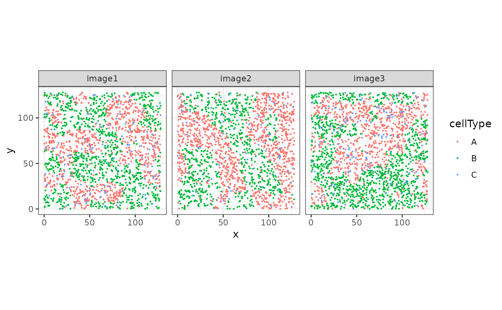
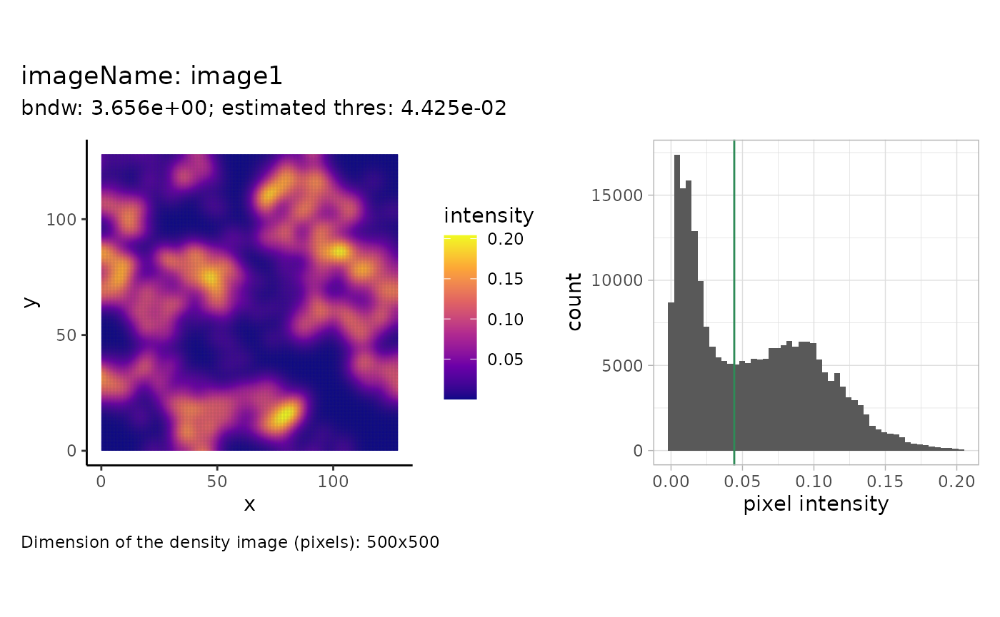
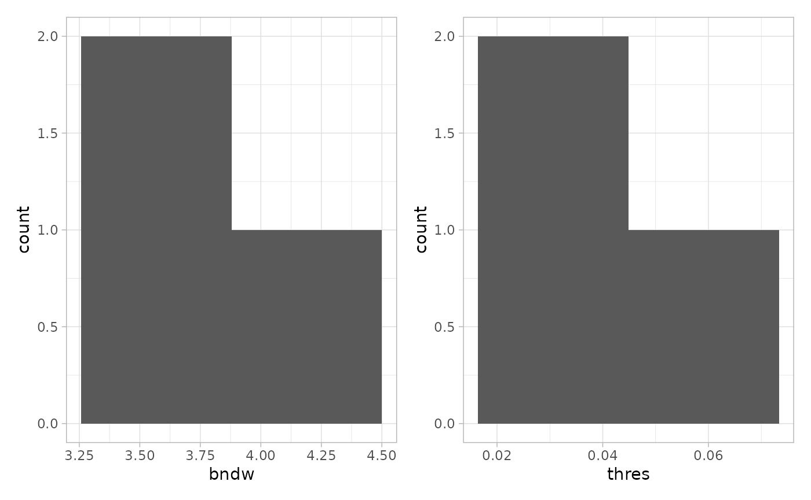
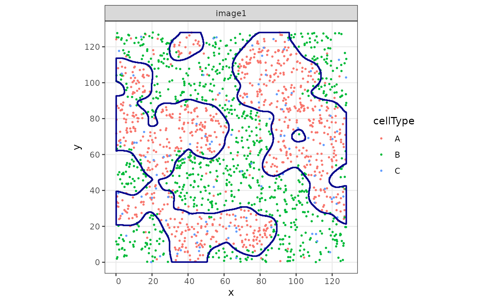
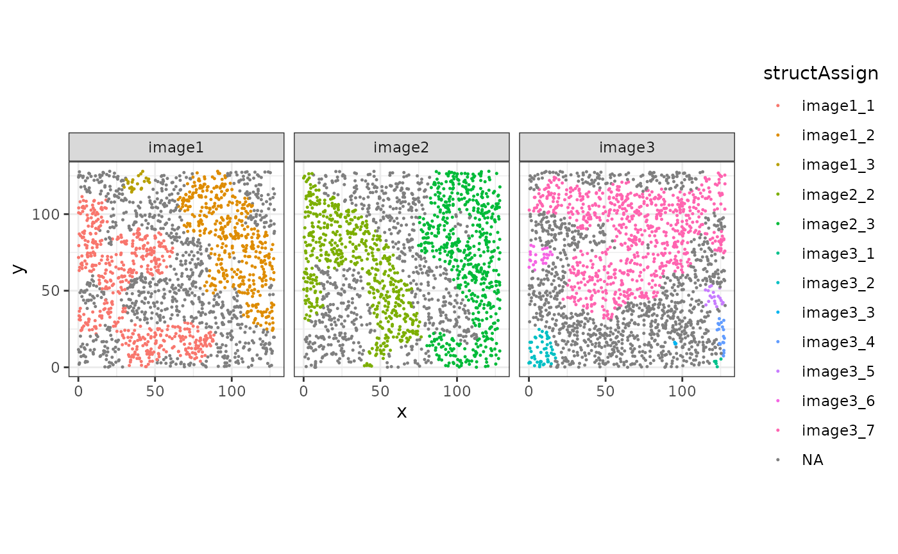
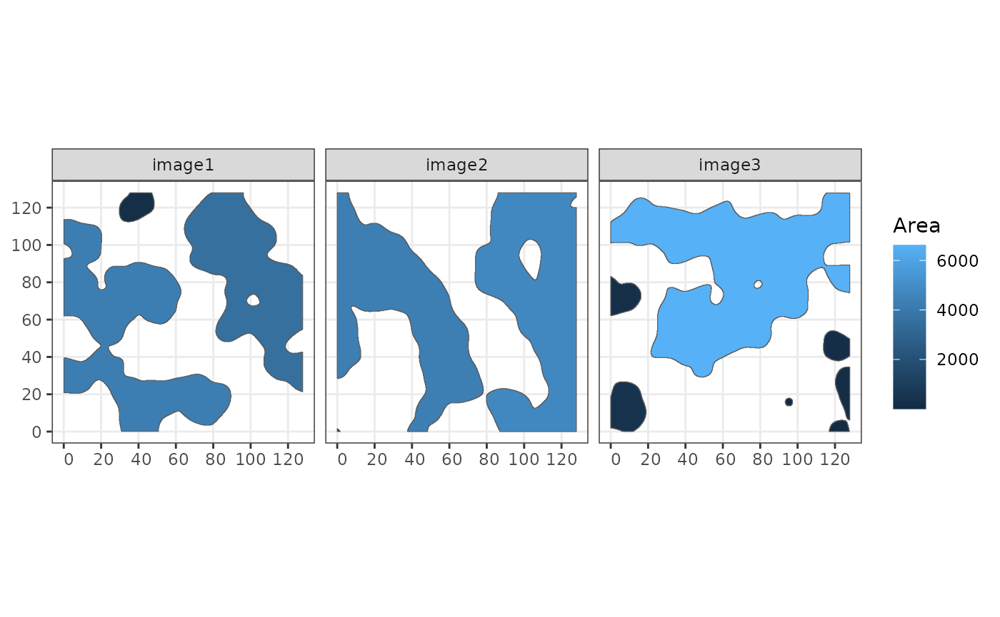
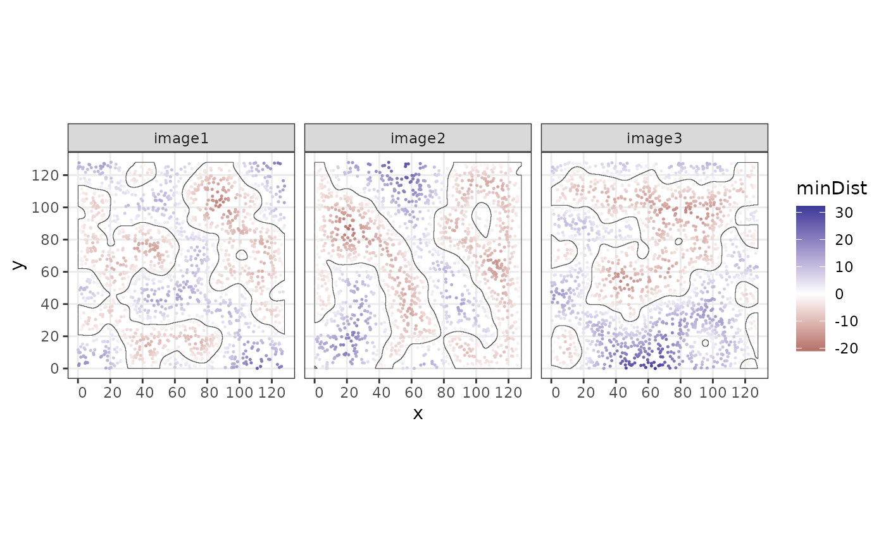
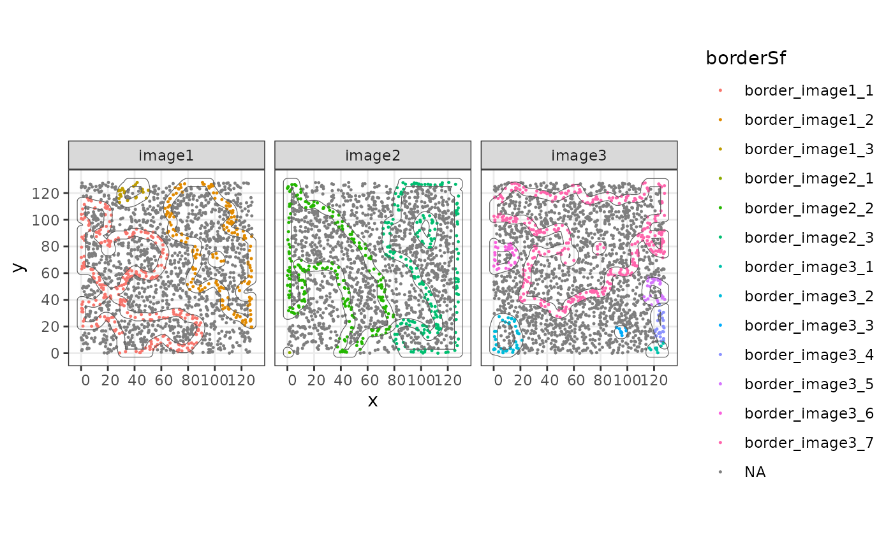
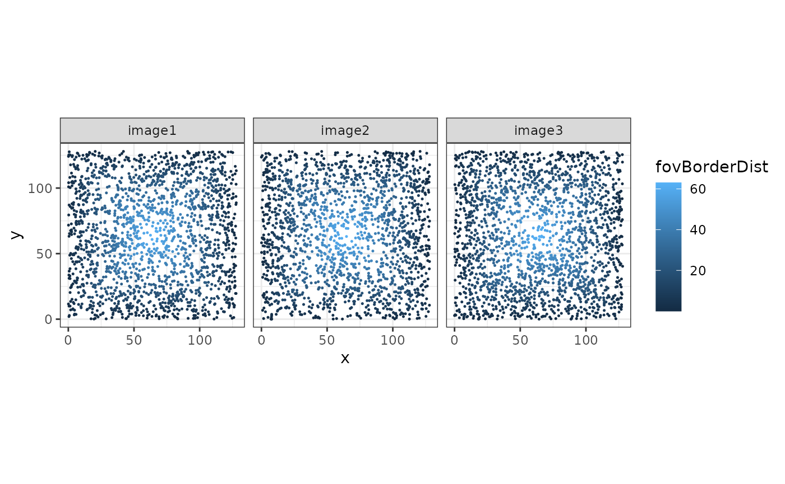
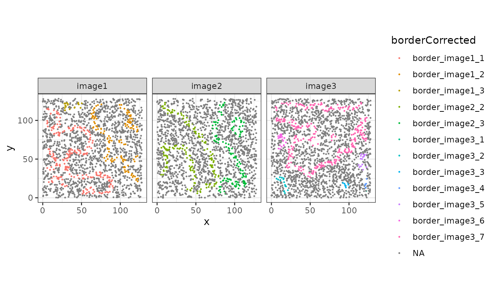

# 01 -- Overview of sosta

Abstract

In this vignette we show different functionalities of `sosta`. First we
perform a density-based reconstruction of structures based on spatial
coordinates. Next, we will calcuate different metrics on the structure
and cell level.

## Installation

The *[sosta](https://bioconductor.org/packages/3.22/sosta)* package can
be installed from Bioconductor as follows:

``` r
if (!requireNamespace("BiocManager")) {
    install.packages("BiocManager")
}
BiocManager::install("sosta")
```

## Setup

For this vignette, we will need several additional packages:

``` r
library("sosta")
library("dplyr")
library("tidyr")
library("ggplot2")
library("sf")
library("SpatialExperiment")

theme_set(theme_bw())
```

## Introduction

As an example, we will load an simulated dataset with three images and
three cell types A, B and C, stored as a
*[SpatialExperiment](https://bioconductor.org/packages/3.22/SpatialExperiment)*
object:

``` r
# load the data
data("sostaSPE")
sostaSPE
#> class: SpatialExperiment 
#> dim: 0 5641 
#> metadata(0):
#> assays(0):
#> rownames: NULL
#> rowData names(0):
#> colnames: NULL
#> colData names(3): cellType imageName sample_id
#> reducedDimNames(0):
#> mainExpName: NULL
#> altExpNames(0):
#> spatialCoords names(2) : x y
#> imgData names(0):
```

``` r
cbind(colData(sostaSPE), spatialCoords(sostaSPE)) |>
    as.data.frame() |>
    ggplot(aes(x = x, y = y, color = cellType)) +
    geom_point(size = 0.25) +
    facet_wrap(~imageName) +
    coord_equal()
```



The goal is to reconstruct, or segment, the cellular “structures” given
by cell type A.

## Structure reconstruction

### Reconstruction of structures for one image

In this example, we will reconstruct cellular *structures* based on the
point pattern density of the cells of type A. We will start with
estimating parameters that are used for reconstruction afterwards. For
one image, this can be illustrated as follows:

``` r
shapeIntensityImage(
    sostaSPE,
    marks = "cellType",
    imageCol = "imageName",
    imageId = "image1",
    markSelect = "A"
)
```



We see the pixel-wise density image on the left and a histogram of the
intensity values on the right. The estimated threshold is roughly the
mean between the two modes of the (truncated) pixel intensity
distribution. The dimensions of the pixel image are specified on the
bottom left. The dimensions correspond to the density image, setting a
higher value for the `dim` parameter will result in a higher resolution
density image but will not change how many points are within a pixel.
This can be changed by varying the smoothing parameter (`bndw`).

This was done for one image. The function
`estimateReconstructionParametersSPE` returns two plots with the
estimated parameters for each image in the dataset. The parameter `bndw`
is the bandwidth parameter that is used for estimating the intensity
profile of the point pattern. The parameter `thres` is the estimated
parameter for the density threshold for reconstruction.

``` r
n <- estimateReconstructionParametersSPE(
    sostaSPE,
    marks = "cellType",
    imageCol = "imageName",
    markSelect = "A",
    plotHist = TRUE
)
```


We will use the mean of the two estimated vectors as our parameters.

``` r
(thresSPE <- mean(n$thres))
#> [1] 0.04467379
(bndwSPE <- mean(n$bndw))
#> [1] 3.804571
```

We now use the function `reconstructShapeDensity` to segment the
cell-type-A structure into regions. The result is a collection of
*[sf](https://CRAN.R-project.org/package=sf)* polygons (Pebesma 2018).

``` r
(struct <- reconstructShapeDensityImage(
    sostaSPE,
    marks = "cellType",
    imageCol = "imageName",
    imageId = "image1",
    markSelect = "A",
    bndw = bndwSPE,
    dim = 500,
    thres = thresSPE
))
#> Simple feature collection with 3 features and 0 fields
#> Geometry type: POLYGON
#> Dimension:     XY
#> Bounding box:  xmin: 0.1061074 ymin: 0.1104626 xmax: 127.8393 ymax: 127.9601
#> CRS:           NA
#>                     sostaPolygon
#> 1 POLYGON ((3.938104 113.6409...
#> 2 POLYGON ((96.41697 125.6588...
#> 3 POLYGON ((47.11194 127.4487...
```

Let’s plot both the points and the segmented polygons.

``` r
cbind(
    colData(sostaSPE[, sostaSPE$imageName == "image1"]),
    spatialCoords(sostaSPE[, sostaSPE$imageName == "image1"])
) |>
    as.data.frame() |>
    ggplot(aes(x = x, y = y, color = cellType)) +
    geom_point(size = 0.5) +
    facet_wrap(~imageName) +
    coord_equal() +
    geom_sf(
        data = struct,
        fill = NA,
        color = "darkblue",
        inherit.aes = FALSE, # this is important
        linewidth = 0.75
    )
#> Coordinate system already present.
#> ℹ Adding new coordinate system, which will replace the existing one.
```


If no arguments are given, the function `reconstructShapeDensityImage`
estimates the reconstruction parameters internally. The bandwidth is
estimated using cross validation using the function `bw.diggle` of the
*[spatstat.explore](https://CRAN.R-project.org/package=spatstat.explore)*
package. The threshold is estimated by taking the mean between the two
modes of the pixel intensity distribution as illustrated above.

``` r
struct2 <- reconstructShapeDensityImage(
    sostaSPE,
    marks = "cellType",
    imageCol = "imageName",
    imageId = "image1",
    markSelect = "A",
    dim = 500
)
```

``` r
cbind(
    colData(sostaSPE[, sostaSPE$imageName == "image1"]),
    spatialCoords(sostaSPE[, sostaSPE$imageName == "image1"])
) |>
    as.data.frame() |>
    ggplot(aes(x = x, y = y, color = cellType)) +
    geom_point(size = 0.5) +
    facet_wrap(~imageName) +
    coord_equal() +
    geom_sf(
        data = struct2,
        fill = NA,
        color = "darkblue",
        inherit.aes = FALSE, # this is important
        linewidth = 0.75
    )
#> Coordinate system already present.
#> ℹ Adding new coordinate system, which will replace the existing one.
```



### Reconstruction of structures for all images

The function `reconstructShapeDensitySPE` reconstructs the cell-type-A
structure for all images in the `spe` object. We use the estimated
parameters from above.

``` r
allStructs <- reconstructShapeDensitySPE(
    sostaSPE,
    marks = "cellType",
    imageCol = "imageName",
    markSelect = "A",
    bndw = bndwSPE,
    thres = thresSPE,
    nCores = 1
)
```

### Intersection with cells

Next, we assign cells in the `SpatialExperiment` object to their
specific structure. This is useful for later calculations. Such that the
function can match the cells to the correct structures, we need the
`colnames` to be defined in the `SpatialExperiment` object.

``` r
# Define colnames by numbering the cells
colnames(sostaSPE) <- paste0("cell_", c(1:dim(sostaSPE)[2]))
```

``` r
assign <- assingCellsToStructures(sostaSPE, allStructs,
    imageCol = "imageName", nCores = 1
)
# Assign using the correct order of the columns in the spe object
sostaSPE$structAssign <- assign[colnames(sostaSPE)]
```

``` r
cbind(colData(sostaSPE), spatialCoords(sostaSPE)) |>
    as.data.frame() |>
    ggplot(aes(x = x, y = y, color = structAssign)) +
    geom_point(size = 0.25) +
    facet_wrap(~imageName) +
    coord_equal()
```



## Structure level metrics

### Proportion of cell types within structures

Using the function `cellTypeProportions`, we can estimate the proportion
of cell types within each individual structure.

``` r
cellTypeProportions(sostaSPE, "structAssign", "cellType")
#>                  A          B          C
#> image1_1 0.7996255 0.12172285 0.07865169
#> image1_2 0.8302326 0.08837209 0.08139535
#> image1_3 0.8333333 0.12500000 0.04166667
#> image2_2 0.8609626 0.09447415 0.04456328
#> image2_3 0.8770764 0.07475083 0.04817276
#> image3_1 0.8000000 0.20000000 0.00000000
#> image3_2 0.6200000 0.28000000 0.10000000
#> image3_3 1.0000000 0.00000000 0.00000000
#> image3_4 0.7894737 0.21052632 0.00000000
#> image3_5 0.8421053 0.10526316 0.05263158
#> image3_6 0.7307692 0.19230769 0.07692308
#> image3_7 0.8088235 0.10160428 0.08957219
```

### Shape Metrics

The function `totalShapeMetrics` calculates a set of geometric metrics
related to the shape of the structures.

``` r
shapeMetrics <- totalShapeMetrics(allStructs)
head(shapeMetrics)
#>                  image1_1     image1_2    image1_3  image2_1     image2_2
#> Area         4250.2792228 3574.6477409 226.9959779 1.3752774 4295.1222139
#> Compactness     0.1346764    0.2519490   0.6080376 0.4581489    0.1953486
#> Eccentricity    0.7875707    0.4641678   0.8363778 0.9999739    0.5647329
#> Circularity     0.4723775    0.5970360   0.8846882 0.5943689    0.4862921
#> Solidity        0.5963449    0.8051348   0.9769469 0.8936170    0.6614292
#> Curl            0.6224990    0.3932054   0.2617308 0.3922730    0.4574191
#>                  image2_3   image3_1    image3_2   image3_3     image3_4
#> Area         4746.6716180 51.8620571 417.5778496 12.6875650 145.71079859
#> Compactness     0.2150477  0.5718048   0.6331764  0.6342179   0.35221739
#> Eccentricity    0.4239889  0.5710073   0.7120634  0.9381917   0.27046967
#> Circularity     0.5075727  0.7502777   0.8892681  0.9053567   0.45173303
#> Solidity        0.7430950  0.9653074   0.9832153  0.9440389   0.96512887
#> Curl            0.4753033  0.1632771   0.1889006  0.2827801   0.09665593
#>                 image3_5    image3_6     image3_7
#> Area         186.3240867 234.8507530 6621.3393593
#> Compactness    0.6428357   0.5221272    0.1752898
#> Eccentricity   0.8736600   0.7688595    0.7542569
#> Circularity    0.9288492   0.7443243    0.5683033
#> Solidity       0.9787015   0.9320010    0.6863814
#> Curl           0.2514767   0.2936578    0.6032739
```

``` r
cbind(allStructs, t(shapeMetrics)) |>
    ggplot() +
    geom_sf(aes(fill = Area)) +
    facet_wrap(~imageName)
```



## Cell level metrics

### Distance to structure border

Using the function `minBoundaryDistances`, we can compute the distance
to the border structure. Negative values indicate that the points lie
inside the structure.

``` r
sostaSPE$minDist <- minBoundaryDistances(
    spe = sostaSPE, imageCol = "imageName",
    structColumn = "structAssign", allStructs = allStructs
)

cbind(colData(sostaSPE), spatialCoords(sostaSPE)) |>
    as.data.frame() |>
    ggplot(aes(x = x, y = y, color = minDist)) +
    geom_point(size = 0.25) +
    facet_wrap(~imageName) +
    coord_equal() +
    scale_colour_gradient2() +
    geom_sf(
        data = allStructs,
        fill = NA,
        inherit.aes = FALSE
    ) +
    facet_wrap(~imageName)
#> Coordinate system already present.
#> ℹ Adding new coordinate system, which will replace the existing one.
```



This information can be used to define border cells by thresholding to a
range of positive and negative values.

``` r
sostaSPE$border <- ifelse(abs(sostaSPE$minDist) < 3, TRUE, FALSE)


cbind(colData(sostaSPE), spatialCoords(sostaSPE)) |>
    as.data.frame() |>
    ggplot(aes(x = x, y = y, color = border)) +
    geom_point(size = 0.25) +
    facet_wrap(~imageName) +
    coord_equal() +
    geom_sf(
        data = allStructs,
        fill = NA,
        inherit.aes = FALSE
    ) +
    facet_wrap(~imageName)
#> Coordinate system already present.
#> ℹ Adding new coordinate system, which will replace the existing one.
```


Alternatively, borders can be defined using `st_difference` and
`st_buffer` on the structure object. In this case we will have an `sf`
polygon that correspond to the border region.

``` r
borders <- lapply(
    st_geometry(allStructs),
    \(x) st_difference(st_buffer(x, 3), st_buffer(x, -3))
) |>
    st_as_sfc() |>
    st_as_sf() # both functions needed for proper conversion

borders$imageName <- allStructs$imageName
borders$borderID <- paste0("border_", allStructs$structID)

borderAssign <- assingCellsToStructures(sostaSPE,
    borders,
    imageCol = "imageName",
    uniqueId = "borderID",
    nCores = 1
)
# Assign using the correct order of the columns in the spe object
sostaSPE$borderSf <- borderAssign[colnames(sostaSPE)]
```

``` r
cbind(colData(sostaSPE), spatialCoords(sostaSPE)) |>
    as.data.frame() |>
    ggplot(aes(x = x, y = y, color = borderSf)) +
    geom_point(size = 0.25) +
    facet_wrap(~imageName) +
    coord_equal() +
    geom_sf(
        data = borders,
        fill = NA,
        inherit.aes = FALSE
    ) +
    facet_wrap(~imageName)
#> Coordinate system already present.
#> ℹ Adding new coordinate system, which will replace the existing one.
```



### Structure boundary vs FOV boundary

When defining border cells, the field of view (FOV) can cut through the
reconstructed polygon(s). This can cause cells that are actually inside
the structure to be classified as border cells. To avoid this, we
compute the distance to the FOV boundary and remove cells that are close
to it.

The FOV in this example ranges from coordinates 0 to 128 in the $x$ and
$y$ direction. We therefore define polygons that span the entire FOV.
Since there are multiple samples, we replicate these polygons and label
them accordingly.

``` r
# create the fov bounding box using st_bbox
fov_bbox <- st_bbox(c(xmin = 0, ymin = 0, xmax = 128, ymax = 128))

# convert to polygon
fov <- st_as_sfc(fov_bbox)

# one fov per image
fovBorder <- rep(fov, length(unique(sostaSPE$imageName))) |>
  st_as_sf()

# name the polygons accordingly
fovBorder$imageName <- unique(sostaSPE$imageName)

fovBorder
#> Simple feature collection with 3 features and 1 field
#> Geometry type: POLYGON
#> Dimension:     XY
#> Bounding box:  xmin: 0 ymin: 0 xmax: 128 ymax: 128
#> CRS:           NA
#>                                x imageName
#> 1 POLYGON ((0 0, 128 0, 128 1...    image1
#> 2 POLYGON ((0 0, 128 0, 128 1...    image2
#> 3 POLYGON ((0 0, 128 0, 128 1...    image3
```

Now we use the function `minBoundaryDistances` to get the distances to
the FOV border.

``` r
sostaSPE$fovBorderDist <- minBoundaryDistances(
  spe = sostaSPE,
  imageCol = "imageName",
  structColumn = "imageName", # here any variable that is true for all cells
  allStructs = fovBorder
) |> 
  abs()
```

``` r
cbind(colData(sostaSPE), spatialCoords(sostaSPE)) |>
    as.data.frame() |>
    ggplot(aes(x = x, y = y, color = fovBorderDist)) +
    geom_point(size = 0.25) +
    facet_wrap(~imageName) +
    coord_equal() +
    facet_wrap(~imageName)
```



We can use the distance to the FOV border to correct the border
assignments.

``` r
sostaSPE$borderCorrected <- 
  ifelse(sostaSPE$fovBorderDist > 5, sostaSPE$borderSf, NA)
```

``` r
cbind(colData(sostaSPE), spatialCoords(sostaSPE)) |>
    as.data.frame() |>
    ggplot(aes(x = x, y = y, color = borderCorrected)) +
    geom_point(size = 0.25) +
    facet_wrap(~imageName) +
    coord_equal() +
    facet_wrap(~imageName)
```



## Session Info

``` r
sessionInfo()
#> R version 4.5.3 (2026-03-11)
#> Platform: x86_64-pc-linux-gnu
#> Running under: Ubuntu 24.04.4 LTS
#> 
#> Matrix products: default
#> BLAS:   /usr/lib/x86_64-linux-gnu/openblas-pthread/libblas.so.3 
#> LAPACK: /usr/lib/x86_64-linux-gnu/openblas-pthread/libopenblasp-r0.3.26.so;  LAPACK version 3.12.0
#> 
#> locale:
#>  [1] LC_CTYPE=C.UTF-8       LC_NUMERIC=C           LC_TIME=C.UTF-8       
#>  [4] LC_COLLATE=C.UTF-8     LC_MONETARY=C.UTF-8    LC_MESSAGES=C.UTF-8   
#>  [7] LC_PAPER=C.UTF-8       LC_NAME=C              LC_ADDRESS=C          
#> [10] LC_TELEPHONE=C         LC_MEASUREMENT=C.UTF-8 LC_IDENTIFICATION=C   
#> 
#> time zone: UTC
#> tzcode source: system (glibc)
#> 
#> attached base packages:
#> [1] stats4    stats     graphics  grDevices utils     datasets  methods  
#> [8] base     
#> 
#> other attached packages:
#>  [1] SpatialExperiment_1.20.0    SingleCellExperiment_1.32.0
#>  [3] SummarizedExperiment_1.40.0 Biobase_2.70.0             
#>  [5] GenomicRanges_1.62.1        Seqinfo_1.0.0              
#>  [7] IRanges_2.44.0              S4Vectors_0.48.0           
#>  [9] BiocGenerics_0.56.0         generics_0.1.4             
#> [11] MatrixGenerics_1.22.0       matrixStats_1.5.0          
#> [13] sf_1.1-0                    ggplot2_4.0.2              
#> [15] tidyr_1.3.2                 dplyr_1.2.0                
#> [17] sosta_1.3.4                 BiocStyle_2.38.0           
#> 
#> loaded via a namespace (and not attached):
#>  [1] DBI_1.3.0              bitops_1.0-9           deldir_2.0-4          
#>  [4] rlang_1.1.7            magrittr_2.0.4         e1071_1.7-17          
#>  [7] compiler_4.5.3         spatstat.geom_3.7-3    png_0.1-9             
#> [10] systemfonts_1.3.2      fftwtools_0.9-11       vctrs_0.7.2           
#> [13] pkgconfig_2.0.3        fastmap_1.2.0          magick_2.9.1          
#> [16] XVector_0.50.0         labeling_0.4.3         rmarkdown_2.30        
#> [19] ragg_1.5.2             purrr_1.2.1            xfun_0.57             
#> [22] cachem_1.1.0           jsonlite_2.0.0         goftest_1.2-3         
#> [25] DelayedArray_0.36.0    spatstat.utils_3.2-2   jpeg_0.1-11           
#> [28] tiff_0.1-12            terra_1.9-1            parallel_4.5.3        
#> [31] R6_2.6.1               bslib_0.10.0           RColorBrewer_1.1-3    
#> [34] spatstat.data_3.1-9    spatstat.univar_3.1-7  jquerylib_0.1.4       
#> [37] Rcpp_1.1.1             bookdown_0.46          knitr_1.51            
#> [40] tensor_1.5.1           Matrix_1.7-4           tidyselect_1.2.1      
#> [43] abind_1.4-8            yaml_2.3.12            EBImage_4.52.0        
#> [46] codetools_0.2-20       spatstat.random_3.4-5  spatstat.explore_3.8-0
#> [49] lattice_0.22-9         tibble_3.3.1           withr_3.0.2           
#> [52] S7_0.2.1               evaluate_1.0.5         desc_1.4.3            
#> [55] units_1.0-1            proxy_0.4-29           polyclip_1.10-7       
#> [58] pillar_1.11.1          BiocManager_1.30.27    KernSmooth_2.23-26    
#> [61] smoothr_1.2.1          RCurl_1.98-1.18        scales_1.4.0          
#> [64] class_7.3-23           glue_1.8.0             tools_4.5.3           
#> [67] locfit_1.5-9.12        fs_2.0.1               grid_4.5.3            
#> [70] nlme_3.1-168           patchwork_1.3.2        cli_3.6.5             
#> [73] spatstat.sparse_3.1-0  textshaping_1.0.5      viridisLite_0.4.3     
#> [76] S4Arrays_1.10.1        gtable_0.3.6           sass_0.4.10           
#> [79] digest_0.6.39          classInt_0.4-11        SparseArray_1.10.9    
#> [82] rjson_0.2.23           htmlwidgets_1.6.4      farver_2.1.2          
#> [85] htmltools_0.5.9        pkgdown_2.2.0          lifecycle_1.0.5
```

## References

Pebesma, Edzer. 2018. “Simple Features for R: Standardized Support for
Spatial Vector Data.” *The R Journal* 10 (1): 439.
<https://doi.org/10.32614/RJ-2018-009>.
